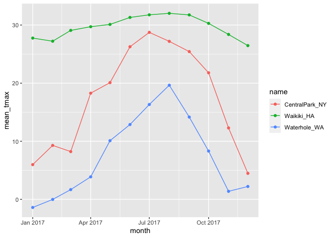

numeric_eda
================
Aaron Mittel
2022-09-29

## Let’s import data

## `group_by`

``` r
weather_df %>%
  group_by(name, month)
```

    ## # A tibble: 1,095 × 7
    ## # Groups:   name, month [36]
    ##    name           id          date        prcp  tmax  tmin month     
    ##    <chr>          <chr>       <date>     <dbl> <dbl> <dbl> <date>    
    ##  1 CentralPark_NY USW00094728 2017-01-01     0   8.9   4.4 2017-01-01
    ##  2 CentralPark_NY USW00094728 2017-01-02    53   5     2.8 2017-01-01
    ##  3 CentralPark_NY USW00094728 2017-01-03   147   6.1   3.9 2017-01-01
    ##  4 CentralPark_NY USW00094728 2017-01-04     0  11.1   1.1 2017-01-01
    ##  5 CentralPark_NY USW00094728 2017-01-05     0   1.1  -2.7 2017-01-01
    ##  6 CentralPark_NY USW00094728 2017-01-06    13   0.6  -3.8 2017-01-01
    ##  7 CentralPark_NY USW00094728 2017-01-07    81  -3.2  -6.6 2017-01-01
    ##  8 CentralPark_NY USW00094728 2017-01-08     0  -3.8  -8.8 2017-01-01
    ##  9 CentralPark_NY USW00094728 2017-01-09     0  -4.9  -9.9 2017-01-01
    ## 10 CentralPark_NY USW00094728 2017-01-10     0   7.8  -6   2017-01-01
    ## # … with 1,085 more rows

## `summarize()`

Let’s group and then summarize!

``` r
weather_df %>% 
  group_by(name, month) %>% 
  summarize(
    n_obs = n()
  )
```

    ## `summarise()` has grouped output by 'name'. You can override using the
    ## `.groups` argument.

    ## # A tibble: 36 × 3
    ## # Groups:   name [3]
    ##    name           month      n_obs
    ##    <chr>          <date>     <int>
    ##  1 CentralPark_NY 2017-01-01    31
    ##  2 CentralPark_NY 2017-02-01    28
    ##  3 CentralPark_NY 2017-03-01    31
    ##  4 CentralPark_NY 2017-04-01    30
    ##  5 CentralPark_NY 2017-05-01    31
    ##  6 CentralPark_NY 2017-06-01    30
    ##  7 CentralPark_NY 2017-07-01    31
    ##  8 CentralPark_NY 2017-08-01    31
    ##  9 CentralPark_NY 2017-09-01    30
    ## 10 CentralPark_NY 2017-10-01    31
    ## # … with 26 more rows

can we count in other ways?

``` r
weather_df %>% 
  count(name, month)
```

    ## # A tibble: 36 × 3
    ##    name           month          n
    ##    <chr>          <date>     <int>
    ##  1 CentralPark_NY 2017-01-01    31
    ##  2 CentralPark_NY 2017-02-01    28
    ##  3 CentralPark_NY 2017-03-01    31
    ##  4 CentralPark_NY 2017-04-01    30
    ##  5 CentralPark_NY 2017-05-01    31
    ##  6 CentralPark_NY 2017-06-01    30
    ##  7 CentralPark_NY 2017-07-01    31
    ##  8 CentralPark_NY 2017-08-01    31
    ##  9 CentralPark_NY 2017-09-01    30
    ## 10 CentralPark_NY 2017-10-01    31
    ## # … with 26 more rows

don’t use `table()` as this is not a dataframe and therefore can’t be
used for anything else.

``` r
weather_df %>% 
  pull(month) %>%
  table()
```

you can have mutiple summaries

``` r
weather_df %>%
  group_by(month) %>%
  summarize(
    n_obs = n(),
    n_distinct = n_distinct(date)
  )
```

    ## # A tibble: 12 × 3
    ##    month      n_obs n_distinct
    ##    <date>     <int>      <int>
    ##  1 2017-01-01    93         31
    ##  2 2017-02-01    84         28
    ##  3 2017-03-01    93         31
    ##  4 2017-04-01    90         30
    ##  5 2017-05-01    93         31
    ##  6 2017-06-01    90         30
    ##  7 2017-07-01    93         31
    ##  8 2017-08-01    93         31
    ##  9 2017-09-01    90         30
    ## 10 2017-10-01    93         31
    ## 11 2017-11-01    90         30
    ## 12 2017-12-01    93         31

## a brief aside on 2x2 tables

``` r
weather_df %>% 
  mutate(
    cold = case_when(
      tmax <  5 ~ "cold",
      tmax >= 5 ~ "not_cold",
      TRUE      ~ ""
  )) %>% 
  filter(name != "Waikiki_HA") %>% 
  group_by(name, cold) %>% 
  summarize(count = n())
```

    ## `summarise()` has grouped output by 'name'. You can override using the
    ## `.groups` argument.

    ## # A tibble: 4 × 3
    ## # Groups:   name [2]
    ##   name           cold     count
    ##   <chr>          <chr>    <int>
    ## 1 CentralPark_NY cold        44
    ## 2 CentralPark_NY not_cold   321
    ## 3 Waterhole_WA   cold       172
    ## 4 Waterhole_WA   not_cold   193

``` r
weather_df %>% 
  mutate(cold = case_when(
    tmax <  5 ~ "cold",
    tmax >= 5 ~ "not_cold",
    TRUE     ~ ""
  )) %>% 
  filter(name != "Waikiki_HA") %>% 
  janitor::tabyl(name, cold)
```

    ##            name cold not_cold
    ##  CentralPark_NY   44      321
    ##    Waterhole_WA  172      193

## general summaries

``` r
weather_df %>%
  group_by(name, month) %>% 
  summarize(
    n_obs = n(),
    mean_tmax = mean(tmax, na.rm = TRUE),
    sd_prcp = sd(prcp),
    median_tmax = median(tmax, na.rm = TRUE)
  ) %>% view
```

    ## `summarise()` has grouped output by 'name'. You can override using the
    ## `.groups` argument.

``` r
weather_df %>%
  group_by(name, month) %>% 
  summarize(across(prcp:tmin,mean))
```

    ## `summarise()` has grouped output by 'name'. You can override using the
    ## `.groups` argument.

    ## # A tibble: 36 × 5
    ## # Groups:   name [3]
    ##    name           month       prcp  tmax   tmin
    ##    <chr>          <date>     <dbl> <dbl>  <dbl>
    ##  1 CentralPark_NY 2017-01-01  39.5  5.98  0.748
    ##  2 CentralPark_NY 2017-02-01  22.5  9.28  1.45 
    ##  3 CentralPark_NY 2017-03-01  43.0  8.22 -0.177
    ##  4 CentralPark_NY 2017-04-01  32.5 18.3   9.66 
    ##  5 CentralPark_NY 2017-05-01  52.3 20.1  12.2  
    ##  6 CentralPark_NY 2017-06-01  40.4 26.3  18.2  
    ##  7 CentralPark_NY 2017-07-01  34.3 28.7  21.0  
    ##  8 CentralPark_NY 2017-08-01  27.4 27.2  19.5  
    ##  9 CentralPark_NY 2017-09-01  17.0 25.4  17.4  
    ## 10 CentralPark_NY 2017-10-01  34.3 21.8  13.9  
    ## # … with 26 more rows

This is a dataframe!!!

``` r
weather_df %>%
  group_by(name, month) %>%
  summarize(
    mean_tmax = mean(tmax, na.rm = TRUE)
  ) %>%
  ggplot(aes(x = month, y = mean_tmax, color = name)) + 
  geom_point() +
  geom_path()
```

    ## `summarise()` has grouped output by 'name'. You can override using the
    ## `.groups` argument.

<!-- -->

``` r
weather_df %>%
  group_by(name, month) %>%
  summarize(
    mean_tmax = mean(tmax, na.rm = TRUE)
  ) %>%
  pivot_wider(
    names_from = name,
    values_from = mean_tmax
  ) %>%
  knitr::kable(digits = 2)
```

    ## `summarise()` has grouped output by 'name'. You can override using the
    ## `.groups` argument.

| month      | CentralPark_NY | Waikiki_HA | Waterhole_WA |
|:-----------|---------------:|-----------:|-------------:|
| 2017-01-01 |           5.98 |      27.76 |        -1.40 |
| 2017-02-01 |           9.28 |      27.22 |        -0.02 |
| 2017-03-01 |           8.22 |      29.08 |         1.67 |
| 2017-04-01 |          18.27 |      29.71 |         3.87 |
| 2017-05-01 |          20.09 |      30.11 |        10.10 |
| 2017-06-01 |          26.26 |      31.31 |        12.87 |
| 2017-07-01 |          28.74 |      31.76 |        16.33 |
| 2017-08-01 |          27.19 |      32.02 |        19.65 |
| 2017-09-01 |          25.43 |      31.74 |        14.16 |
| 2017-10-01 |          21.79 |      30.29 |         8.31 |
| 2017-11-01 |          12.29 |      28.38 |         1.38 |
| 2017-12-01 |           4.47 |      26.46 |         2.21 |
