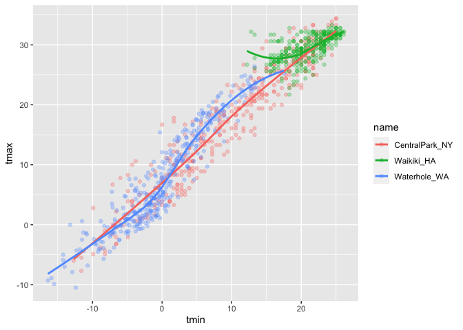
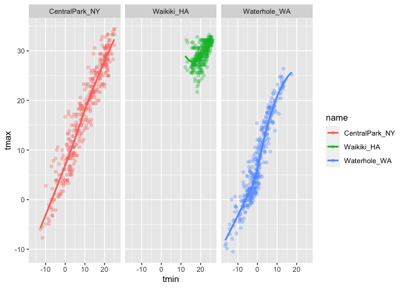
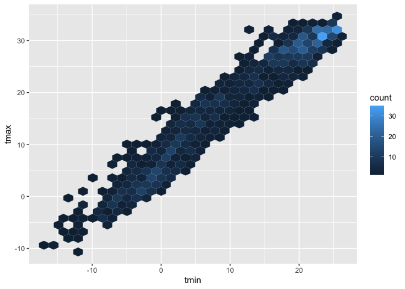

viz_part_01
================
Aaron Mittel
2022-09-29

## Let’s import data

``` r
library(tidyverse)
```

    ## ── Attaching packages ─────────────────────────────────────── tidyverse 1.3.2 ──
    ## ✔ ggplot2 3.3.6      ✔ purrr   0.3.4 
    ## ✔ tibble  3.1.8      ✔ dplyr   1.0.10
    ## ✔ tidyr   1.2.1      ✔ stringr 1.4.1 
    ## ✔ readr   2.1.2      ✔ forcats 0.5.2 
    ## ── Conflicts ────────────────────────────────────────── tidyverse_conflicts() ──
    ## ✖ dplyr::filter() masks stats::filter()
    ## ✖ dplyr::lag()    masks stats::lag()

``` r
library(ggridges)
```

``` r
  weather_df = 
  rnoaa::meteo_pull_monitors(
    c("USW00094728", "USC00519397", "USS0023B17S"),
    var = c("PRCP", "TMIN", "TMAX"), 
    date_min = "2017-01-01",
    date_max = "2017-12-31") %>%
  mutate(
    name = recode(
      id, 
      USW00094728 = "CentralPark_NY", 
      USC00519397 = "Waikiki_HA",
      USS0023B17S = "Waterhole_WA"),
    tmin = tmin / 10,
    tmax = tmax / 10) %>%
  select(name, id, everything())
```

    ## Registered S3 method overwritten by 'hoardr':
    ##   method           from
    ##   print.cache_info httr

    ## using cached file: ~/Library/Caches/R/noaa_ghcnd/USW00094728.dly

    ## date created (size, mb): 2022-09-29 10:31:49 (8.401)

    ## file min/max dates: 1869-01-01 / 2022-09-30

    ## using cached file: ~/Library/Caches/R/noaa_ghcnd/USC00519397.dly

    ## date created (size, mb): 2022-09-29 10:31:53 (1.699)

    ## file min/max dates: 1965-01-01 / 2020-03-31

    ## using cached file: ~/Library/Caches/R/noaa_ghcnd/USS0023B17S.dly

    ## date created (size, mb): 2022-09-29 10:31:55 (0.95)

    ## file min/max dates: 1999-09-01 / 2022-09-30

## Let’s make a scatterplot

``` r
ggplot(weather_df, aes(x=tmin, y=tmax)) +
  geom_point()
```

    ## Warning: Removed 15 rows containing missing values (geom_point).

<!-- -->

## Let’s make the same scatterplot, but different.

``` r
weather_df %>%
  drop_na() %>%
  ggplot(aes(x=tmin, y=tmax)) +
  geom_point()
```

<!-- -->

## Let’s keep making the same plot but different.

``` r
weather_scatterplot =
  weather_df %>%
  drop_na() %>%
  ggplot(aes(x=tmin, y=tmax))

weather_scatterplot +
  geom_point()
```

<!-- -->

## Let’s fancy this up a bit

``` r
weather_df %>%
  ggplot(aes(x=tmin, y=tmax, color = name)) +
  geom_point(alpha = 0.3) +
  geom_smooth(se = FALSE)
```

    ## `geom_smooth()` using method = 'loess' and formula 'y ~ x'

    ## Warning: Removed 15 rows containing non-finite values (stat_smooth).

    ## Warning: Removed 15 rows containing missing values (geom_point).

<!-- -->

## Maybe make separate panels.

``` r
weather_df %>%
  ggplot(aes(x=tmin, y=tmax, color = name)) +
  geom_point(alpha = 0.3) +
  geom_smooth(se = FALSE) +
  facet_grid(. ~ name)
```

    ## `geom_smooth()` using method = 'loess' and formula 'y ~ x'

    ## Warning: Removed 15 rows containing non-finite values (stat_smooth).

    ## Warning: Removed 15 rows containing missing values (geom_point).

<!-- -->

‘tmax’ vs ‘tmin’ is boring. Let’s spice it up a bit.

``` r
weather_df %>%
  ggplot(aes(x = date, y = tmax, color = name)) +
  geom_point(aes(size = prcp), alpha = 0.3) +
  geom_smooth(se = FALSE) +
  facet_grid(. ~ name)
```

    ## `geom_smooth()` using method = 'loess' and formula 'y ~ x'

    ## Warning: Removed 3 rows containing non-finite values (stat_smooth).

    ## Warning: Removed 3 rows containing missing values (geom_point).

<!-- -->

## Some quick stuff

``` r
weather_df %>%
  ggplot(aes(x=tmin, y=tmax)) +
  geom_hex()
```

    ## Warning: Removed 15 rows containing non-finite values (stat_binhex).

<!-- -->
